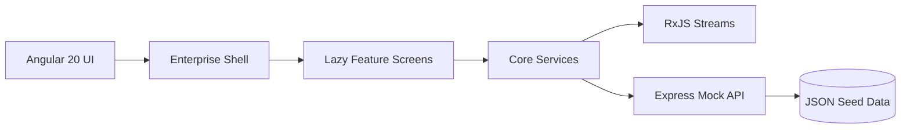

# Architecture

The application uses a modular Angular architecture with route-level lazy loading through `loadComponent`. Core services own authentication, navigation, domain models, and data orchestration. Feature modules isolate dashboard, incident, RITM, epic, ABAP repository, CDS, OData, UAT, transport, support console, governance, documentation, and resume assets.

Key decisions: strict TypeScript, standalone components, reusable page and chart components, SAP Fiori-inspired layout, mock JWT, and GitHub Pages-ready frontend output.
